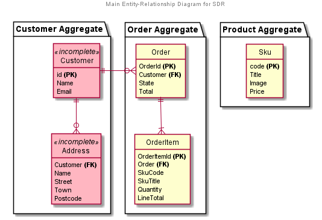
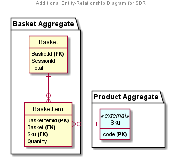

# Guidebook > Data

Following the CQRS pattern, entities have a single write model and can have multiple read models 

## Write

There are three main write aggregates, covering Customers, Orders and Products.

Additional aggregates include the Basket.

